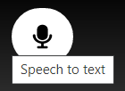
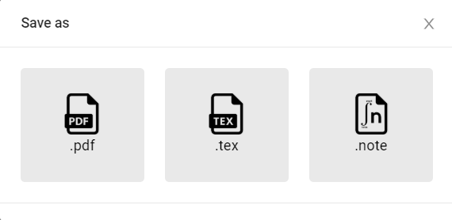

# Welcome to SmartNotes
## Notes, but intelligent.

  <head>
    <link rel="stylesheet" type="text/css" href="/main.css">
  </head>

<video width="320" height="240" controls>
  <source type="video/mp4" src="https://robocop79.github.io/Websiteland//Twitter/FLT.mp4">
</video>

## What is SmartNotes?
_SmartNotes is a text editor that generates suggestions and features or symbols based on the selected suggestion. The application was created with the aim of simplifying the generation of characters and features that are not on the keyboard or requires several time-consuming steps in popular document editors like Google Documents and Microsoft Word._

# **Functions in SmartNotes**
- **Special symbols** - Easy access to different symbols 
 

 
- **Voice to text** - Easy to use only your voice to write your texts
  

 
- **Document files** - Save your document as .tex (LaTeX), .PDF or as SmartNots own format,.note  
 

### **Want more details?**
If you are interested in how SmartNotes was created, the report can be found [here](https://docs.google.com/document/d/1GtBl7qtJfJzKFVy4D-sDy0Vx2M_SFIAdKaXfv2TPz0I/edit?usp=sharing).

<footer>
    	<ul>
        	<li>Erik Hellenberg</li>
            	<li>Henric Andersson</li>
            	<li>David Guirguis</li>
            	<li>Anton Espling</li>
		<li>Joel Vik</li>
            	<li>Samsom Dewitsegid</li>

	</ul>
    </footer>
