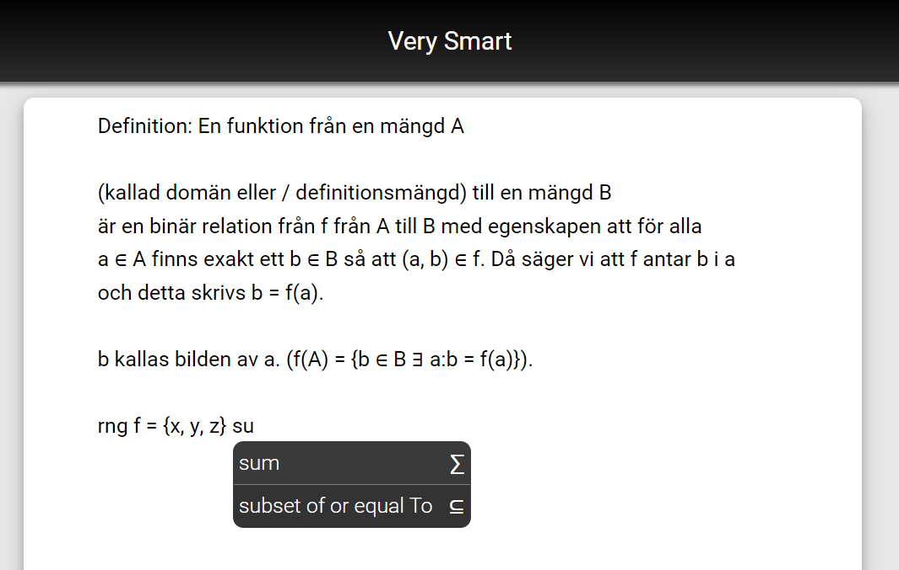

# Welcome to SmartNotes
## Notes, but intelligent.

<video width="320" height="240" controls>
  <source type="video/mp4" src="https://robocop79.github.io/Websiteland//Twitter/FLT.mp4">
</video>

## What is SmartNotes?
_SmartNotes is a text editor that generates suggestions and features or symbols based on the selected suggestion. The application was created with the aim of simplifying the generation of characters and features that are not on the keyboard or requires several time-consuming steps in popular document editors like Google Documents and Microsoft Word._

### **Functions in SmartNotes**
- **Special symbols** - Easy access to different symbols


- **Voice to text** - Easy to use only your voice to write your texts


- **Document files** - Save your document as .tex (LaTeX), .PDF or as SmartNots own format, .note


If you are interested in how SmartNotes was created, the report can be found [here](https://docs.google.com/document/d/1GtBl7qtJfJzKFVy4D-sDy0Vx2M_SFIAdKaXfv2TPz0I/edit?usp=sharing).


You can use the [editor on GitHub](https://github.com/SmartNotes/smartnotes.github.io/edit/master/index.md) to maintain and preview the content for your website in Markdown files.

Whenever you commit to this repository, GitHub Pages will run [Jekyll](https://jekyllrb.com/) to rebuild the pages in your site, from the content in your Markdown files.

### Markdown

Markdown is a lightweight and easy-to-use syntax for styling your writing. It includes conventions for

```markdown
Syntax highlighted code block

# Header 1
## Header 2
### Header 3

- Bulleted
- List

1. Numbered
2. List

**Bold** and _Italic_ and `Code` text

[Link](url) and 
```

For more details see [GitHub Flavored Markdown](https://guides.github.com/features/mastering-markdown/).

### Jekyll Themes

Your Pages site will use the layout and styles from the Jekyll theme you have selected in your [repository settings](https://github.com/SmartNotes/smartnotes.github.io/settings). The name of this theme is saved in the Jekyll `_config.yml` configuration file.

### Support or Contact

Having trouble with Pages? Check out our [documentation](https://help.github.com/categories/github-pages-basics/) or [contact support](https://github.com/contact) and we’ll help you sort it out.
